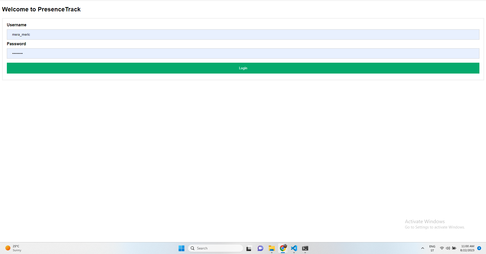
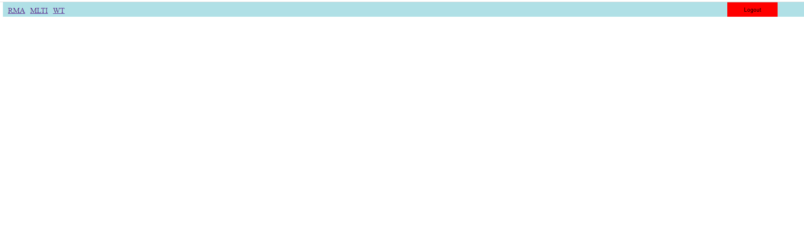
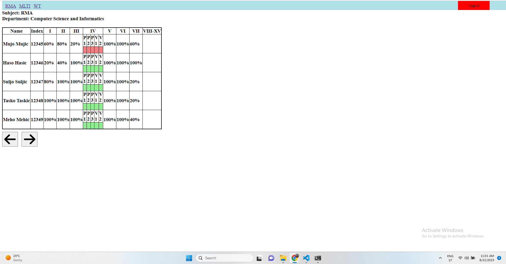

<!-- Improved compatibility of back to top link: See: https://github.com/othneildrew/Best-README-Template/pull/73 -->
<a name="readme-top"></a>

<!-- PROJECT LOGO -->
<br />
<div align="center">
  <a href=" ">
    
  </a>

  <h3 align="center">Presence Track</h3>

  <p align="center">
    Web application for music
    <br />
    <a href=" https://github.com/mkulovac1/PresenceTrack"><strong>Explore the docs »</strong></a>
    <br />
    <br />
    <a href="https://drive.google.com/file/d/1VC_8GBEqaY1UaSRMDOEnmdaok06dCSD0/view?usp=sharing">View Demo</a>
    ·
    <a href="https://github.com/mkulovac1/PresenceTrack/issues">Report Bug</a>
  </p>
</div>

<!-- ABOUT THE PROJECT -->
## About The Project


PresenceTrack is a web application that aims to make it easier for professors to edit the presence of students in their courses. The professor can mark attendance with "yes", "no" and "not entered" in a very easy and simple way, which is also shown in the application demo. This application was created while attending the course "Web technologies" and it was important for passing this course. The focus of this application is not on the appearance of the application itself, but on its functionality. Through the course, it was necessary to present knowledge in programming backend functionality in Vanilla javascript and Node.js, which was done.

<p align="right">(<a href="#readme-top">back to top</a>)</p>


## Demo

You can see a demo of this application on the following link: [CLICK ME](https://drive.google.com/file/d/1VC_8GBEqaY1UaSRMDOEnmdaok06dCSD0/view?usp=sharing)
<p align="right">(<a href="#readme-top">back to top</a>)</p>


## Built With

* HTML
* CSS
* Javascript
* Node.js
* Express

<p align="right">(<a href="#readme-top">back to top</a>)</p>


<!-- GETTING STARTED -->
## Getting Started

To run this project locally you need to do following (prerequisites and installation).

### Prerequisites

* Visual studio code
* Node.js

### Installation

1. Clone the repo
   ```sh
   git clone  https://github.com/mkulovac1/PresenceTrack
   ```
2. Open this project in Visual studio code
3. Type in terminal
   ```sh
   cd app
   ```
4. Install NPM packages through terminal
   ```sh
   npm install
   ```
5. Run application through terminal
   ```js
   npm start
   ```
6. Open in browser this link: localhost:3000/login.html and type username and password which you can find in the documentation folder under the name "credentials for testing"

<p align="right">(<a href="#readme-top">back to top</a>)</p>


<!-- USAGE EXAMPLES -->
## Usage

Here you can see examples of using app.

**Login page:**

<a href=" ">
  
</a>

**A page with a list of subjects (courses) that the professor teaches:**

<a href=" ">
  
</a>

**A Page where the professor can see the attendance of all students in the selected course:**

<a href=" ">
  
</a>

_For more examples, please refer to the [Documentation](https://example.com)_

<p align="right">(<a href="#readme-top">back to top</a>)</p>


<!-- CONTRIBUTING -->
## Contributing

Contributions are what make the open source community such an amazing place to learn, inspire, and create. Any contributions you make are **greatly appreciated**.

If you have a suggestion that would make this better, please fork the repo and create a pull request. You can also simply open an issue with the tag "enhancement".
Don't forget to give the project a star! Thanks again!

1. Fork the Project
2. Create your Feature Branch (`git checkout -b feature/AmazingFeature`)
3. Commit your Changes (`git commit -m 'Add some AmazingFeature'`)
4. Push to the Branch (`git push origin feature/AmazingFeature`)
5. Open a Pull Request

<p align="right">(<a href="#readme-top">back to top</a>)</p>


<!-- CONTACT -->
## Contact

Merim Kulovac, [@merimkulovac](https://www.linkedin.com/in/merimkulovac/), e-mail: merim.kulovac@outlook.com

<p align="right">(<a href="#readme-top">back to top</a>)</p>
